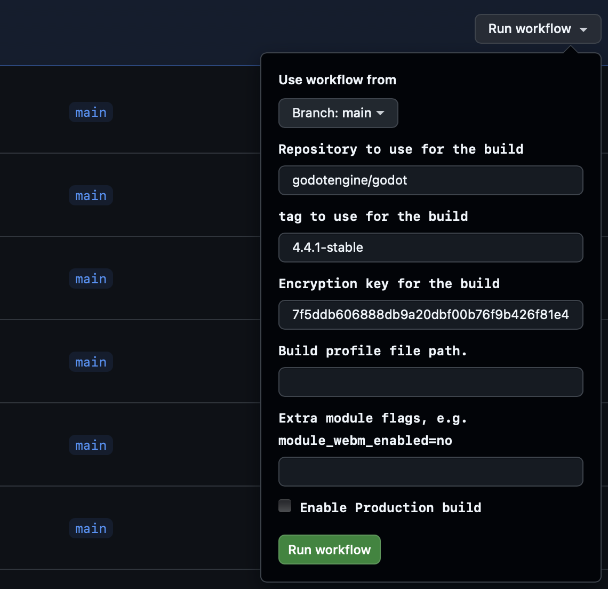
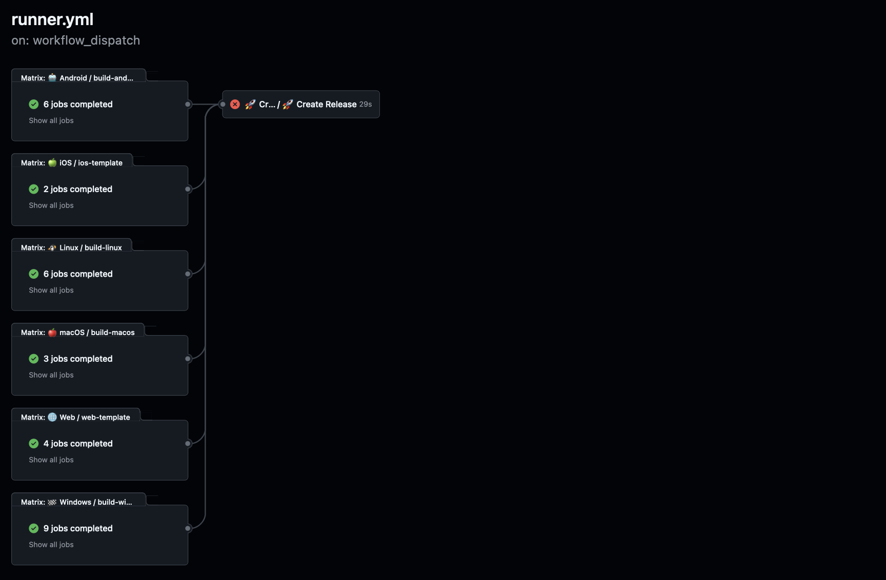
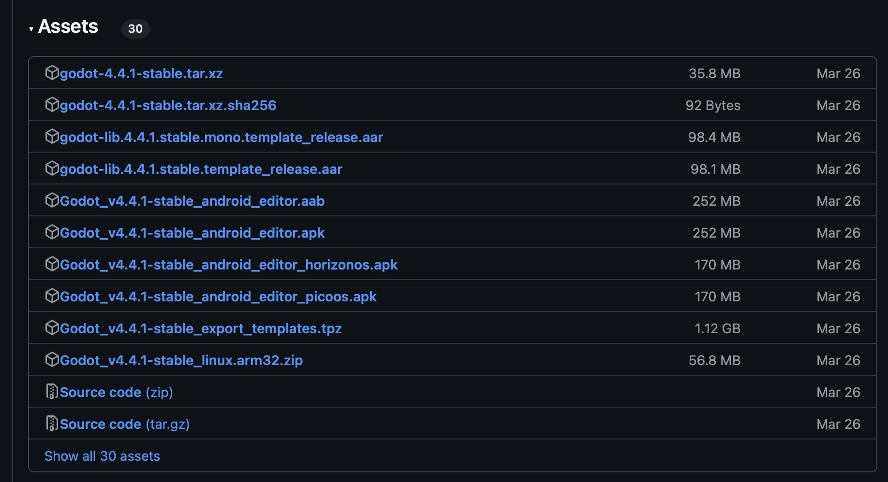

# Godot Builder Action

|[Website](https://appsinacup.com)|[Discord](https://discord.gg/56dMud8HYn)|
|-|-|

Action that builds a custom version of the Godot Engine. You can set a custom godot repo, [encryption key](https://docs.godotengine.org/en/4.2/contributing/development/compiling/compiling_with_script_encryption_key.html), base version, build profile and [modules to disable](https://docs.godotengine.org/en/4.2/development/compiling/optimizing_for_size.html):

If it's cached, the build takes 10 minutes for all targets. Full build can take up to 30m per target (so like 1-2 hours). It builds almost all targets that godot normally builds for export:
- **Android** (template arm64, arm32, x86, x32)
- **iOS** (template arm64)
- **Linux** (editor x64, template x64, x32)
- **macOS** (editor universal, template universal)
- **Windows** (editor x86, x32, arm64, template x86, x32, arm64)
- **Web** (template threads and nothreads, and dlink)

It then creates a draft release (if satisfied with it, you can make a release and use it).

Similar to how godot does, so you can then use it to build or develop your game, but with bugfixes or new features. The release name will be different, but the files name will be similar to the release it is based on.

